```mermaid
classDiagram
    direction TB

    %% ══════════════════════════════════════════
    %% DOMAIN
    %% ══════════════════════════════════════════

    class User {
        +string ID
        +string Email
        +string PasswordHash
        +UserRole Role
        +string TOTPSecret
        +bool TOTPEnabled
        +int FailedAttempts
        +*time.Time LockedUntil
        +time.Time CreatedAt
        +time.Time UpdatedAt
        +IsLocked() bool
    }

    class UserRole {
        <<enumeration>>
        user
        admin
    }

    class RefreshToken {
        +string ID
        +string UserID
        +string TokenHash
        +time.Time ExpiresAt
        +time.Time CreatedAt
    }

    class Transfer {
        +string ID
        +string OwnerID
        +string FileName
        +int64 FileSizeBytes
        +string StoragePath
        +string AccessToken
        +AccessPolicy Policy
        +EncryptionMeta Encryption
        +TransferStatus Status
        +int DownloadCount
        +time.Time CreatedAt
        +time.Time UpdatedAt
        +IsExpired() bool
        +IsDownloadLimitReached() bool
    }

    class TransferStatus {
        <<enumeration>>
        ACTIVE
        EXPIRED
        REVOKED
        DOWNLOADED
    }

    class AccessPolicy {
        +time.Time ExpiresAt
        +int MaxDownloads
        +bool RequireAuth
        +[]string AllowedEmails
    }

    class EncryptionMeta {
        +string Algorithm
        +string IV
        +string Tag
        +string KeyHint
    }

    class AuditLog {
        +string ID
        +string TransferID
        +string OwnerID
        +AuditEventType EventType
        +string ActorID
        +string IPAddress
        +string UserAgent
        +bool Success
        +string Details
        +time.Time CreatedAt
    }

    class AuditEventType {
        <<enumeration>>
        CREATED
        VIEWED
        DOWNLOADED
        MANUALLY_REVOKED
        EXPIRED
        AUTO_DELETED
        UNAUTHORIZED_ACCESS
        USER_LOGIN
        USER_REGISTERED
    }

    class AuditFilter {
        +string TransferID
        +string OwnerID
        +AuditEventType EventType
        +time.Time From
        +time.Time To
        +int Limit
        +int Offset
    }

    class GlobalSettings {
        +int64 MaxFileSizeBytes
        +time.Duration MaxRetentionPeriod
        +time.Duration DefaultRetention
        +int DefaultMaxDownloads
        +time.Time UpdatedAt
        +string UpdatedBy
    }

    %% ══════════════════════════════════════════
    %% REPOSITORY INTERFACES
    %% ══════════════════════════════════════════

    class UserRepository {
        <<interface>>
        +Create(ctx, *User) error
        +FindByEmail(ctx, email) (*User, error)
        +FindByID(ctx, id) (*User, error)
        +UpdateFailedAttempts(ctx, id, count) error
        +LockUntil(ctx, id, until) error
        +ResetLock(ctx, id) error
        +UpdateTOTPSecret(ctx, id, secret) error
        +SetTOTPEnabled(ctx, id, enabled) error
        +SaveRefreshToken(ctx, *RefreshToken) error
        +FindRefreshToken(ctx, hash) (*RefreshToken, error)
        +DeleteRefreshToken(ctx, hash) error
        +DeleteExpiredRefreshTokens(ctx, userID) error
    }

    class TransferRepository {
        <<interface>>
        +Create(ctx, *Transfer) error
        +GetByToken(ctx, token) (*Transfer, error)
        +GetByID(ctx, id) (*Transfer, error)
        +ListByOwner(ctx, ownerID) ([]*Transfer, error)
        +UpdateStatus(ctx, id, status) error
        +IncrementDownloads(ctx, id) error
        +ListExpiredOrLimitReached(ctx) ([]*Transfer, error)
    }

    class AuditRepository {
        <<interface>>
        +Append(ctx, *AuditLog) error
        +List(ctx, AuditFilter) ([]*AuditLog, error)
    }

    class SettingsRepository {
        <<interface>>
        +Get(ctx) (*GlobalSettings, error)
        +Save(ctx, *GlobalSettings) error
    }

    %% ══════════════════════════════════════════
    %% STORAGE & NOTIFIER INTERFACES
    %% ══════════════════════════════════════════

    class StorageProvider {
        <<interface>>
        +Upload(ctx, key, reader, size, contentType) (string, error)
        +Download(ctx, storagePath) (ReadCloser, int64, error)
        +Delete(ctx, storagePath) error
    }

    class Notifier {
        <<interface>>
        +NotifyOwnerFileDeleted(ctx, ownerID, transferID, fileName) error
    }

    class SystemStatsProvider {
        <<interface>>
        +ActiveTransfersCount(ctx) (int64, error)
        +TotalStorageBytes(ctx) (int64, error)
        +SecurityIncidentsCount(ctx, since) (int64, error)
    }

    %% ══════════════════════════════════════════
    %% POSTGRES IMPLEMENTATIONS
    %% ══════════════════════════════════════════

    class UserRepo {
        -pgxpool.Pool pool
        +Create(ctx, *User) error
        +FindByEmail(ctx, email) (*User, error)
        +FindByID(ctx, id) (*User, error)
        +UpdateFailedAttempts(ctx, id, count) error
        +LockUntil(ctx, id, until) error
        +ResetLock(ctx, id) error
        +UpdateTOTPSecret(ctx, id, secret) error
        +SetTOTPEnabled(ctx, id, enabled) error
        +SaveRefreshToken(ctx, *RefreshToken) error
        +FindRefreshToken(ctx, hash) (*RefreshToken, error)
        +DeleteRefreshToken(ctx, hash) error
        +DeleteExpiredRefreshTokens(ctx, userID) error
    }

    class TransferRepo {
        -pgxpool.Pool pool
        +Create(ctx, *Transfer) error
        +GetByToken(ctx, token) (*Transfer, error)
        +GetByID(ctx, id) (*Transfer, error)
        +ListByOwner(ctx, ownerID) ([]*Transfer, error)
        +UpdateStatus(ctx, id, status) error
        +IncrementDownloads(ctx, id) error
        +ListExpiredOrLimitReached(ctx) ([]*Transfer, error)
    }

    class AuditRepo {
        -pgxpool.Pool pool
        +Append(ctx, *AuditLog) error
        +List(ctx, AuditFilter) ([]*AuditLog, error)
    }

    class SettingsRepo {
        -pgxpool.Pool pool
        +Get(ctx) (*GlobalSettings, error)
        +Save(ctx, *GlobalSettings) error
    }

    class StatsProvider {
        -pgxpool.Pool pool
        +ActiveTransfersCount(ctx) (int64, error)
        +TotalStorageBytes(ctx) (int64, error)
        +SecurityIncidentsCount(ctx, since) (int64, error)
    }

    %% ══════════════════════════════════════════
    %% USE CASES
    %% ══════════════════════════════════════════

    class AuthUseCase {
        -UserRepository users
        -AuditRepository auditRepo
        -[]byte jwtSecret
        -Duration accessTTL
        -Duration refreshTTL
        -Duration partialTTL
        +Register(ctx, RegisterInput) (*User, error)
        +Login(ctx, LoginInput) (*LoginResult, error)
        +Verify2FA(ctx, Verify2FAInput) (*TokenPair, error)
        +RefreshTokens(ctx, token) (*TokenPair, error)
        +Logout(ctx, token) error
        +SetupTOTP(ctx, userID) (*TOTPSetupResult, error)
        +ConfirmTOTP(ctx, userID, code) error
        +DisableTOTP(ctx, userID, code) error
        +ValidateAccessJWT(token) (*AuthClaims, error)
    }

    class CreateTransferUseCase {
        -TransferRepository transfers
        -AuditRepository audit
        -StorageProvider store
        -SettingsRepository settings
        -string baseURL
        +Execute(ctx, CreateTransferInput) (*CreateTransferOutput, error)
    }

    class GetFileUseCase {
        -TransferRepository transfers
        -AuditRepository audit
        -StorageProvider store
        +Execute(ctx, GetFileInput) (*GetFileOutput, error)
    }

    class LifecycleUseCase {
        -TransferRepository transfers
        -AuditRepository audit
        -StorageProvider store
        -Notifier notifier
        +Run(ctx, interval) 
    }

    class AuditLogUseCase {
        -AuditRepository audit
        +Execute(ctx, AuditLogInput) (*AuditLogOutput, error)
    }

    class RevokeAccessUseCase {
        -TransferRepository transfers
        -AuditRepository audit
        -StorageProvider store
        +Execute(ctx, RevokeAccessInput) error
        +GetTransferDetails(ctx, transferID, requesterID) (*Transfer, error)
    }

    class ExportAuditUseCase {
        -AuditRepository audit
        +WriteCSV(ctx, ExportInput, Writer) error
    }

    class GlobalSettingsUseCase {
        -SettingsRepository settings
        -SystemStatsProvider stats
        +GetSettings(ctx) (*GlobalSettings, error)
        +UpdateSettings(ctx, UpdateSettingsInput) (*GlobalSettings, error)
        +GetStats(ctx) (*SystemStats, error)
    }
```

## Слои архитектуры

```
┌─────────────────────────────────────────────────────────────┐
│                      HTTP HANDLERS                          │
│   AuthHandler  TransferHandler  AuditHandler  AdminHandler  │
└─────────────────────┬───────────────────────────────────────┘
                      │ вызывает
┌─────────────────────▼───────────────────────────────────────┐
│                     USE CASES                               │
│  AuthUseCase  CreateTransfer  GetFile  RevokeAccess         │
│  Lifecycle    AuditLog        Export   GlobalSettings       │
└──────┬───────────────┬────────────────────┬─────────────────┘
       │               │                    │
       │ использует    │ использует         │ использует
┌──────▼──────┐ ┌──────▼──────┐    ┌───────▼──────────┐
│ REPOSITORY  │ │   STORAGE   │    │    NOTIFIER      │
│ interfaces  │ │  Provider   │    │   interface      │
└──────┬──────┘ └──────┬──────┘    └───────┬──────────┘
       │               │                    │
┌──────▼──────┐ ┌──────▼──────┐    ┌───────▼──────────┐
│  POSTGRES   │ │  stub/MinIO │    │   stub/Email     │
│ UserRepo    │ │             │    │                  │
│ TransferRepo│ │             │    │                  │
│ AuditRepo   │ │             │    │                  │
│ SettingsRepo│ │             │    │                  │
│ StatsProvider│            │    │                  │
└─────────────┘ └─────────────┘    └──────────────────┘
```
